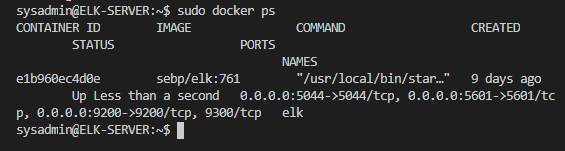

## Automated ELK Stack Deployment

The files in this repository were used to configure the network depicted below.

These files have been tested and used to generate a live ELK deployment on Azure. They can be used to either recreate the entire deployment pictured above. Alternatively, select portions of the .yml files may be used to install only certain pieces of it, such as Filebeat.

  -

This document contains the following details:
- Description of the Topology
- Access Policies
- ELK Configuration
  - Beats in Use
  - Machines Being Monitored
- How to Use the Ansible Build

### Description of the Topology

The main purpose of this network is to expose a load-balanced and monitored instance of DVWA, the D*mn Vulnerable Web Application.

Load balancing ensures that the application will be highly available, in addition to restricting unauthorized access to the network. The load balancers help protect our network by distributing the workload across servers to avoid accidental or intention DoS. Additionally, using the jump box creates a sort of VPN. SSH access to the network is only gained through the jumpbox, which is secured with SSH keys.

Integrating an ELK server allows users to easily monitor the vulnerable VMs for changes to the usage metric and system logs. Filebeat reads and organizes our system and application logs for ease in monitoring. Metricbeat monitors system and service statistics. This allows us to develop a baseline for use in anomaly based intrusion detection.

The configuration details of each machine may be found below.

| Name           | Function       | IP Address | OS    |
|----------------|----------------|------------|-------|
| Jump Box       | Gateway        | 10.0.0.4   | Linux |
| Web-1          | DVWA Server    | 10.0.0.5   | Linux |
| Web-2          | DWVA Server    | 10.0.0.6   | Linux |
| ELK-SERVER     | ELK Monitoring | 10.1.0.4   | Linux |
| Load Balancer  | Load balancing | 23.96.7.30 |       |

### Access Policies

The machines on the internal network are not exposed to the public Internet. 

Only the Jump Box machine can accept connections from the Internet. Access to this machine is only allowed from the following IP addresses:
207.237.255.128

Machines within the network can only be accessed by SSH from the Jump Box..
Additionally the Kibana interface can be accessed at http://104.43.163.56:5601/app/kibana. Access to this is only allowed from the following IP addresses:
207.237.255.128

A summary of the access policies in place can be found in the table below.

| Name       | Publicly Accessible | Allowed IPs     |
|------------|---------------------|-----------------|
| Jump Box   | Yes                 | 207.237.255.128 |
| ELK-SERVER | Yes                 | 207.237.255.128 |
| Web-1      | No                  |                 |
| Web-2      | No                  |                 |

### Elk Configuration

Ansible was used to automate configuration of the ELK machine. No configuration was performed manually, which is advantageous because it makes maintenance and reconfiguration much simpler, in line with CICD practices. This setup is portable, simple to deploy, and scalable.

The playbook implements the following tasks:
-  Install Docker
-  Install Python module
-  Install Python Docker module
-  Increase maximum memory usage in the VM
-  Install a Docker ELK container with published ports 5601, 9200, 5044

The following screenshot displays the result of running `docker ps` after successfully configuring the ELK instance.

### Target Machines & Beats
This ELK server is configured to monitor the following machines:
- Web-1: 10.0.0.5
- Web-2: 10.0.0.6

We have installed the following Beats on these machines:
- Metricbeat
- Filebeat

These Beats allow us to collect the following information from each machine:
- Metricbeat allows us to see common system resource usage, such as CPU, memory, and disk. Filebeat can be used to access any system log, for instance access logs to determine who has logged in to the server.

### Using the Playbook
In order to use the playbook, you will need to have an Ansible control node already configured. Assuming you have such a control node provisioned: 

SSH into the control node and follow the steps below:
- Copy the <beat>_config.yml file to /etc/<beat>/<beat>.yml
- Update the <beat>_config file to include:
output.elasticsearch:
hosts: ["10.1.0.4:9200"]
username: "elastic"
password: "changeme"
...
setup.kibana:
host: "10.1.0.4:5601"

- Run the playbook, and navigate to http://23.101.115.52:5601/app/kibana to check that the installation worked as expected.

